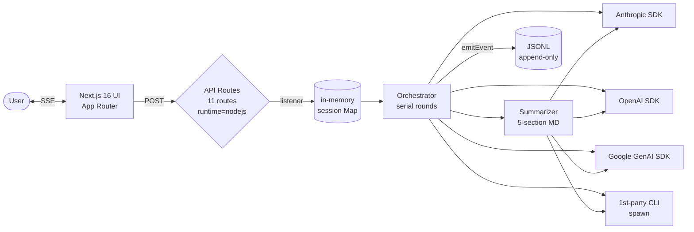

# Architecture — Agora

This document explains **how** Agora works and **why** it works that way. For a higher-level introduction, see [README.en.md](./README.en.md). For the canonical Korean spec (ADR + JSONL schema), see [AGENTS.md](./AGENTS.md).

---

## 1. System overview



| Layer            | Files                                                                                              | Responsibility                                                       |
| ---------------- | -------------------------------------------------------------------------------------------------- | -------------------------------------------------------------------- |
| **UI**           | `src/app/page.tsx`, `src/components/*`                                                             | Sidebar, chat view, intervention input, settings modal               |
| **API**          | `src/app/api/*`                                                                                    | Session lifecycle (start, intervene, pause, resume, stop, stream)    |
| **Orchestrator** | `src/lib/orchestrator{.ts,-round.ts,-stream.ts}`                                                   | Serial rounds, abort signals, timeouts, error/budget gates           |
| **Adapters**     | `src/lib/agents/*-{api,cli}.ts`                                                                    | 6 adapters (Claude/Codex/Gemini × API/CLI)                          |
| **Session store**| `src/lib/session-store.ts`, `src/lib/transcript.ts`                                                | In-memory state + event log + listener fan-out                       |
| **Summarizer**   | `src/lib/summarizer.ts`                                                                            | One-shot final artifact (bypasses speak() for compression purity)    |
| **Logger**       | `src/lib/logger.ts`                                                                                | JSONL append-only with secret-scrubbing invariants                   |

---

## 2. Key design decisions (with trade-offs)

### 2.1 Serial rounds, not parallel

**Decision:** All active agents speak **one at a time** within a round. The next speaker reads the previous speaker's full message before generating its own.

**Trade-off:**
- ✅ Genuine talk-show ping-pong. Agents react to each other instead of producing interleaved monologues.
- ✅ The `transcript.push()` from speaker N is visible to speaker N+1 in the **same round**, no extra plumbing.
- ❌ Slower wall-clock latency than `Promise.all` (~3× for a 3-agent round).
- ❌ A single slow agent stalls the whole round (mitigated by `AGENT_FIRST_TOKEN_TIMEOUT_MS = 60_000` + treating timeout as PASS).

**Rejected alternative:** parallel calls with mutex on transcript writes — would still give "interleaved monologues" because each agent's input transcript was frozen at round start, missing other agents' just-spoken messages.

**Code:** `orchestrator-round.ts:runRound()` — `for (const speaker of speakerOrder)` is the load-bearing line.

---

### 2.2 Two AbortControllers — `roundAbort` and `sessionAbort`

**Decision:** The orchestrator maintains **two separate AbortController instances**. `roundAbort` is recreated each round and fired by interrupts. `sessionAbort` is created once per session and fired by STOP, budget exhaustion, or time cap.

**Why this matters:** If you used a single AbortController, "interrupt" (user wants to redirect mid-round) and "stop" (user wants to end the whole session) would be indistinguishable. The orchestrator needs to know:

- After interrupt → start a **new round** with the user's message in transcript.
- After stop → exit the session loop entirely + emit `session_end`.

**Composition:** Each speaker call uses `AbortSignal.any([roundAbort.signal, sessionAbort.signal])` — fires when **either** is aborted. Node 20+ native `AbortSignal.any` automatically cleans up listeners when the composed signal is GC'd, preventing the listener-leak that ad-hoc composition tends to cause.

**Code:** `orchestrator.ts:intervene()` (round abort), `stop()` (session abort), `session-store.ts:anySignal()` (composition).

---

### 2.3 SSE, not WebSocket

**Decision:** Server pushes events to the browser via **SSE** (`text/event-stream`). The client never sends back through the same channel — it uses POST endpoints (`/api/intervene`, `/api/pause`, etc.) for that.

**Why:** The traffic shape is **unidirectional streaming + occasional client commands**. WebSocket gives bidirectional but at the cost of:
- Manual reconnection logic (vs. SSE auto-reconnect)
- Proxy compatibility (Railway/Cloudflare/etc handle SSE transparently)
- Header-based auth (sessionId in URL query, not handshake)

The 30-second keepalive comment line (`stream/route.ts:KEEPALIVE_MS`) prevents proxies from closing idle connections.

**Trade-off accepted:** Two RTTs for client-initiated actions (POST + receive on SSE), but the actions are infrequent (interrupt, stop, etc.) so latency doesn't bite.

---

### 2.4 BYOK (Bring Your Own Key), no OAuth

**Decision:** API keys live only in the browser's `sessionStorage`. The server forwards them to SDK calls but never persists them.

**Honest reasoning:**
- Anthropic and OpenAI **don't expose third-party OAuth providers** for general developers — only enterprise via direct contracts. Building a fake "Connect with Anthropic" button would be misleading.
- Google does support OAuth, but for consistency with the other two we keep BYOK across all three providers in Stage A.

**De facto OAuth substitute:** CLI mode (`child_process.spawn` of `claude`/`codex`/`gemini`) lets users leverage **their own** OAuth/subscription tokens stored by the 1st-party CLIs.

**Trade-off:** XSS in the browser would expose keys (Stage A single-user demo assumption). Stage B will move to a server-side vault + Stripe-backed hosted-key tier.

**Code:** `lib/agent-factory.ts:createAdapter()` — keys flow through `spec.apiKey` from `/api/session` request body to SDK constructor, never touching disk.

---

### 2.5 In-memory session store

**Decision:** Sessions live in a single-process `Map<sessionId, SessionState>` (`session-store.ts:sessions`).

**Trade-off:** This is the **single biggest architectural limitation** of Stage A.

| Property                           | Stage A (current)                     | Stage B target                                  |
| ---------------------------------- | ------------------------------------- | ----------------------------------------------- |
| Server restart                      | All sessions lost                     | Postgres-persisted, resume on reconnect         |
| Horizontal scale                    | Sticky sessions or N/A                | Redis pub/sub for fan-out across instances      |
| Multi-tenant isolation              | None (sessionId knowledge → access)   | NextAuth + ACL on `getSession()`                |
| Session log replay after refresh    | New session                           | URL-keyed sessionId + GET /api/session/{id}     |

The decision is **deliberate** for Stage A — over-engineering would slow down the demo cycle. The escape hatch is documented in [CLAUDE.md §4 Out-of-Scope](./CLAUDE.md).

---

### 2.6 Summarizer bypasses `speak()`

**Decision:** The final artifact summarizer calls SDKs directly (`callClaudeApi()`, `callGptApi()`, etc.) instead of going through the `AgentAdapter.speak()` interface.

**Why interface consistency was broken:**
1. `speak()` enforces the `[PASS]` convention. The summarizer should never PASS — it's not participating in the debate, it's compressing it.
2. `speak()` participates in round-level abort signals. The summarizer runs **after** `sessionAbort.abort()` (when STOP triggers it), so signal composition would throw immediately.

**Mitigation:** The summarizer has its own timeouts (45s API / 90s CLI) and a separate AbortController not composed with `sessionAbort`. STOP doesn't kill the artifact.

**Code:** `summarizer.ts:runFinalArtifact()` — see the 3-line block comment at the top explaining the three design decisions.

---

### 2.7 JSONL append-only with secret-scrubbing invariants

**Decision:** Every event (token chunk, agent_start, status, user_message, …) becomes a JSONL line in `./logs/{sessionId}.jsonl`. Logger uses `fs.createWriteStream({flags:'a'})`.

**Invariants:**
- **No secrets ever:** API keys, OAuth tokens, CLI args containing credentials are **never** logged. Auto-verified by `scripts/scrub-check.sh`.
- **Stderr suppressed by length, not by content:** CLI failures echo "stderr suppressed (Nbytes)" instead of leaking raw stderr (which can contain refresh tokens).
- **Schema lives in code:** `OrchestratorEvent` discriminated union in `session-store.ts`. Both UI client and JSONL logger consume the same type.

**Code:** `lib/agents/cli-stream.ts:runCliOneshot()` — see the inline comment about stderr handling.

---

### 2.8 Robustness: 4 end reasons + recovery

A session can end for **exactly four reasons** (`session_end.reason`):

| Reason              | Trigger                                                           | Code                                          |
| ------------------- | ----------------------------------------------------------------- | --------------------------------------------- |
| `user_stop`         | STOP button OR all adapters fail 3 consecutive rounds             | `orchestrator.ts:checkSessionGate()`          |
| `max_turns`         | Default 30 turns (clamped 1~200)                                  | `constants.ts:MAX_TURNS`                      |
| `budget_exceeded`   | Default 100k tokens (clamped 1k~1M)                               | `constants.ts:MAX_SESSION_TOKENS`             |
| `time_exceeded`     | Default 5 min (clamped 30s~60min)                                 | `constants.ts:MAX_SESSION_DURATION_MS`        |

**Time cap re-checked inside the token loop** (`orchestrator-stream.ts:while loop`) — not just at round start — so a runaway adapter can't blow past the cap. **Token chunks emit one event each**, so the loop has natural sample points.

**Error streak:** Per-adapter consecutive errors counted in `errorStreak: Map<AgentId, number>`. After `MAX_AGENT_ERROR_STREAK = 3`, that adapter is **skipped** without emitting more events (avoids `agent_error` flooding ActivityLog). When **all** adapters hit the cap, session auto-stops with `user_stop` reason.

---

## 3. The orchestrator algorithm (pseudocode)

```
runSession(state):
  emit session_start
  loop:
    reason = checkSessionGate(state)
    if reason: break with reason

    while state.status == paused:
      await (notifier OR sessionAbort)
      if sessionAbort.aborted: break outer

    drain userQueue → transcript (each emits user_message)

    state.roundAbort = new AbortController()
    speakerOrder = rotate(activeAgents, state.turn)
    anySpeak = false

    for speaker in speakerOrder:
      if any abort fired: break

      result = await callSpeakerGuarded(speaker, withTimeout=60s)

      switch result.kind:
        pass:    emit agent_pass; reset errorStreak; continue
        timeout: emit agent_timeout; continue
        error:   emit agent_error; bump errorStreak; continue
        speak:
          emit agent_start
          fullText = await streamSpeakerTokens(state, speaker, result.stream)
          if fullText.trim() == "[PASS]": emit agent_pass; continue
          transcript.push({role: speaker.id, text: fullText})
          if result.usage: state.sessionTokens += usage
          anySpeak = true

    consecutivePass = anySpeak ? 0 : consecutivePass + 1
    if consecutivePass >= 2 and userQueue empty: enter idle

    state.turn += 1

  if summarizerId: await runFinalArtifact(state)  # one-shot, separate timeout
  emit session_end(reason)
  state.status = stopped
```

The key insight: **interrupt fires `roundAbort` only**, so the loop continues to the next iteration where a new round starts with the user's message already drained into transcript.

---

## 4. Adapter interface — `AgentAdapter`

```ts
interface AgentAdapter {
  id: "claude" | "codex" | "gemini";
  mode: "api" | "cli";
  model?: string;
  speak(input: SpeakInput): Promise<SpeakResult>;
}

type SpeakResult =
  | { kind: "pass" }
  | {
      kind: "speak";
      stream: AsyncIterable<string>;
      usage?: () => Promise<{ inputTokens: number; outputTokens: number }>;
    };
```

**Invariants enforced by the adapter:**
1. Augment system prompt with `PASS_INSTRUCTION` (so the model knows it can return `[PASS]`).
2. Connect `signal.aborted` either to the SDK's native abort or by polling.
3. Yield only raw text chunks — wrapping (event types, timestamps) is the orchestrator's job.

The 6 adapters share `adapter-helpers.ts` for transcript serialization and prompt augmentation, ensuring **`[LABEL]` prefix consistency** across all of them. The summarizer relies on this prefix for `[Claude]`/`[Codex]`/`[Gemini]` attribution in the "핵심 논점" section.

---

## 5. Prompt caching (Claude API specifically)

`@anthropic-ai/sdk` supports `cache_control: { type: "ephemeral" }` blocks. The adapter splits the user content into **two** blocks:

```ts
[
  { type: "text", text: serializeTranscript(transcript.slice(0, -1)),
    cache_control: { type: "ephemeral" } },          // ← cacheable prefix
  { type: "text", text: serializeTranscript(transcript.slice(-1)) }, // ← uncached delta
]
```

Within the same round, when speaker N+1 calls Claude, the **prior transcript** (everything except the just-spoken message from speaker N) is the same prefix Claude saw earlier with caching enabled — **cache hit**, ~10× cheaper input tokens, faster TTFT.

**Code:** `claude-api.ts:buildUserContent()`. The system prompt is also cache-controlled separately.

---

## 6. Test strategy

| Layer                      | Tool                                       | Coverage                                              |
| -------------------------- | ------------------------------------------ | ----------------------------------------------------- |
| Pure helpers               | `vitest` unit tests (4 files, 26 tests)    | adapter-helpers, cli-stream, transcript, session-store |
| Orchestrator state machine | `scripts/verify-orchestrator.ts`           | 9 scenarios: normal, interrupt, timeout, error, pause-resume, hotswap, pause-mid-stop, budget, time |
| API integration            | `scripts/verify-api.sh`                    | curl-based round-trip on each route                   |
| Secret hygiene             | `scripts/scrub-check.sh`                   | grep over JSONL for known credential patterns         |

The orchestrator regressions are intentionally **integration-level**, not unit-level — the state machine has too many cross-cutting concerns (transcript, abort signals, error streak, time cap, listener fan-out) to mock cleanly. Real adapters (`fake.ts` echo adapter) drive the loop.

---

## 7. Known limitations

These are **intentional Stage A trade-offs**, deferred to Stage B:

- **No multi-tenant auth.** sessionId knowledge alone grants access to SSE stream. Single-user demo assumption.
- **No OAuth.** BYOK only — XSS exposure surface.
- **No persistence.** Server restart = all sessions lost. JSONL is per-instance disk, ephemeral on Railway.
- **No mobile UX for input.** Pure read-only on small screens (Stage A M6 will add the readonly view; full mobile is Stage B).
- **No rolling summary.** Final-artifact-once is enough for Stage A. Rolling adds cost+UX noise that doesn't pay off until sessions are longer than the 5-min default cap.

See [CLAUDE.md §4 Out-of-Scope](./CLAUDE.md) and [docs/DEPLOY.md §10](./docs/DEPLOY.md) for the Stage B roadmap.

---

## 8. File map cheat sheet

```
Want to understand …                  Read …
──────────────────────────────────────────────────────────────────────
Round loop & abort signal handling    src/lib/orchestrator-round.ts
Token streaming + first-token race    src/lib/orchestrator-stream.ts
4 end reasons & limit clamping        src/lib/orchestrator.ts
SSE wire format + listener fan-out    src/app/api/stream/route.ts
                                    + src/lib/session-store.ts
Adapter contract                       src/lib/agents/types.ts
Prompt caching split                   src/lib/agents/claude-api.ts
CLI spawn / abort / stripping banner   src/lib/agents/cli-stream.ts
Final artifact one-shot policy         src/lib/summarizer.ts
JSONL secret-scrubbing                 src/lib/logger.ts
                                    + scripts/scrub-check.sh
Model ID single source of truth        src/lib/models.ts
```
