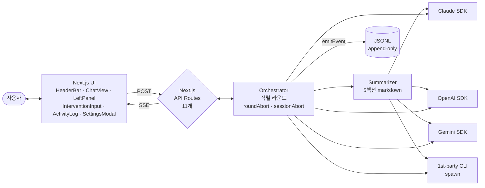
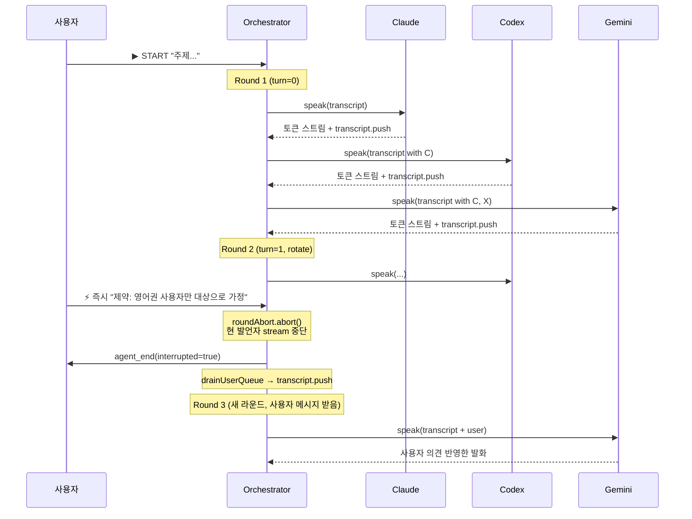
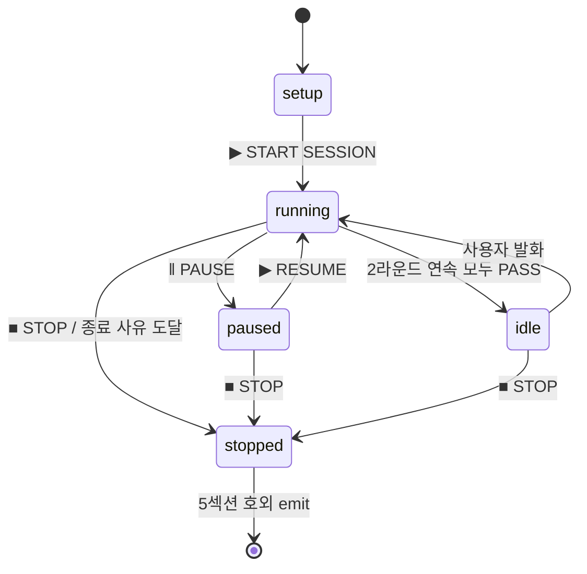
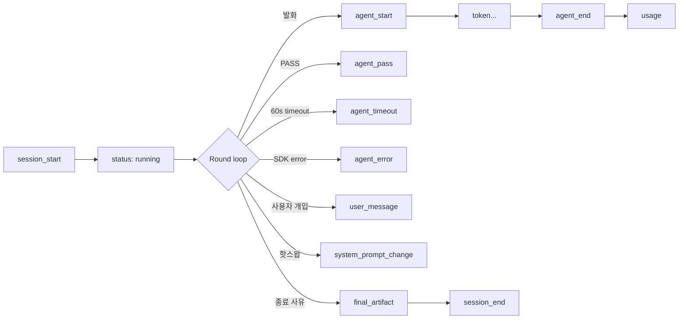

# Agora — 사용자가 함께 참여하는 멀티 AI 토론 도구

여러 AI 에이전트(Claude · GPT · Gemini)가 **직렬 라운드**로 토크쇼식 핑퐁을 주고받고, 사용자는 진행 중에 의견을 끼워넣을 수 있는 웹 도구입니다. **도메인 무관** — 어떤 주제든 본인의 시스템 프롬프트로 정의해 사용하세요.

> **차별화 한 줄** — 단순 다중 호출이 아니라 **사용자가 토론에 함께 참여**합니다.
> 토론 중 "제약: 영어권 사용자만 대상으로 한다고 가정해주세요" 같은 의견을 끼워넣으면 진행 중 발언이 즉시 끊기고 다음 라운드가 그 의견을 받아 재정렬됩니다.

|             |                                                                                         |
| ----------- | --------------------------------------------------------------------------------------- |
| 스택        | Next.js 16 · TypeScript strict · Tailwind v4 · SSE · JSONL                              |
| 어댑터      | Claude / OpenAI(Codex) / Gemini × API · CLI = **6종**                                   |
| 사용자 개입 | ⚡ 즉시 인터럽트 · ↳ 큐 · ‖ Pause/Resume · ■ Stop = **4종**                             |
| 결과물      | 종료 시 `결론 / 핵심 논점 / 사용자 개입 반영 / 미해결 / 액션 아이템` **5섹션 markdown** |
| 종료 사유   | `user_stop` · `max_turns` · `budget_exceeded` · `time_exceeded`                         |
| 검증        | typecheck 0 · 9 시나리오 회귀 · scrub-check 0 시크릿                                    |

---

## 빠른 시작

```bash
git clone https://github.com/doublesilver/agora && cd agora
npm install
npm run dev   # → http://localhost:3000
```

| 1단계                                             | 2단계            | 3단계           |
| ------------------------------------------------- | ---------------- | --------------- |
| ⚙ → AI 에이전트 → **2개 이상 활성** + API 키 입력 | 좌패널 주제 입력 | ▶ START SESSION |

5초 안에 첫 토큰이 흐르면 OK. 영문 README는 [README.en.md](./README.en.md).

---

## 활용 예시 — 어떤 토론에 쓰나

도메인은 본인이 정의합니다. 시스템 프롬프트로 각 AI에 역할을 지정하고, 토론 주제는 좌패널에 자유롭게.

| 직군·상황                    | 활용 예                                                                          |
| ---------------------------- | -------------------------------------------------------------------------------- |
| **PM·기획**                  | 1차 요구사항 문서 초안 → 두 AI가 우선순위·수용 기준 토론, 빠진 시나리오 발견    |
| **전략·아키텍트**            | A안 vs B안 트레이드오프 비교, 사용자가 도중에 새 제약 추가하면 즉시 재정렬       |
| **콘텐츠·라이팅**            | 글의 명확성·구조·톤 다듬기, 한 AI가 reviewer / 다른 AI가 editor 역할             |
| **연구·학습**                | 가설 토론 + 반례 제시 + 검증 실험 설계                                          |
| **개발자 페어 검토**         | 설계 의사결정 토론, "OAuth vs JWT" 같은 트레이드오프를 다각도로                  |

좌패널 프리셋(요구사항 정리 · 의사결정 비교 · 글 다듬기) 3개는 마중물일 뿐 — 본인 도메인을 그대로 입력해도 OK.

---

## 시스템 아키텍처



---

## 직렬 라운드 + 사용자 개입



핵심: 인터럽트는 **`roundAbort`만 fire**해서 라운드만 끊고 세션은 살립니다. 사용자 메시지가 transcript에 push된 뒤 새 라운드가 자동 시작됩니다.

---

## 세션 라이프사이클



종료 사유 4종 (`session_end.reason`):

- **user_stop** — STOP 버튼 또는 모든 어댑터 3회 연속 실패
- **max_turns** — 30턴 도달 (사용자 1~200 변경 가능)
- **budget_exceeded** — 100k 토큰 도달 (사용자 1k~1M 변경 가능)
- **time_exceeded** — 5분 도달 (사용자 30s~60분 변경 가능)

---

## 결과물 — 5섹션 markdown

세션 종료 시 사용자가 지정한 결과 정리 담당이 transcript를 받아 단발 호출로 생성:

```markdown
## 결론

2~4문장 핵심 결론 + 가장 강한 근거.

## 핵심 논점

- [Claude] 단일 SaaS 모델은 학습 곡선이 짧지만 팀 협업 기능 부재로 이탈 위험
- [Codex] 무료 BYOK + 호스팅 키 유료 2 tier 구조 권장
- [Gemini] 반례 — tier보다 모듈별 add-on 모델이 retention에 유리

## 사용자 개입 반영

사용자가 "제약: 영어권 사용자만 대상으로 가정"을 끼워넣자
토론이 i18n 우선순위 하락·결제 통화 단순화 방향으로 재조정됨.

## 미해결

- 팀 워크스페이스의 권한 모델

## 액션 아이템

- 호스팅 키 단가 7일 측정 → 유료 tier 가격 결정
```

`핵심 논점`의 발언자 attribution이 AI들이 진짜 다른 목소리 냈는지 한눈에 보여주고, `사용자 개입 반영` 섹션이 차별화 포인트를 결과물에서 직접 증명합니다.

---

## 6 어댑터

| 에이전트           | API 모드                                                         | CLI 모드                                |
| ------------------ | ---------------------------------------------------------------- | --------------------------------------- |
| **Claude**         | `@anthropic-ai/sdk` · default `claude-opus-4-7` (prompt caching) | `claude -p --output-format stream-json` |
| **Codex** (OpenAI) | `openai` · default `gpt-5`                                       | `codex exec --json --sandbox read-only` |
| **Gemini**         | `@google/genai` · default `gemini-2.5-pro`                       | `gemini -p -y -o stream-json`           |

API 모드는 ⚙ → AI 에이전트에서 모델 직접 선택 (datalist 자동완성). CLI 모드는 `~/.claude/settings.json` · `~/.gemini/GEMINI.md` 등 사용자 머신 설정을 그대로 따릅니다.

> 💡 **시연은 API 모드 권장** — CLI는 매 라운드 cold start ~25s + 인증 핸드셰이크. 5분 박스에선 라운드 회전이 3~5회로 제한. API는 첫 토큰 1~3s라 같은 시간에 라운드 10회+ 가능.

---

## 환경변수

UI에서 키를 입력하면 환경변수는 불필요합니다. dev 편의용으로만 `.env.example` 참조:

```ini
ANTHROPIC_API_KEY=
OPENAI_API_KEY=
GEMINI_API_KEY=
```

CLI 모드에서 PATH 누락 시 절대경로 override:

```bash
AGORA_CLAUDE_BIN=/path/to/claude \
AGORA_CODEX_BIN=/path/to/codex \
AGORA_GEMINI_BIN=/path/to/gemini \
npm run dev
```

> ⚠️ **터미널에서 직접 `npm run dev`** 하세요. VSCode/Cursor GUI나 Finder에서 띄우면 IDE의 PATH만 spawn에 상속돼 CLI를 못 잡을 수 있습니다.

---

## JSONL 세션 로그

세션마다 `./logs/{sessionId}.jsonl`에 한 줄 = 한 이벤트로 append. 14종 이벤트 (스키마 단일 출처: `AGENTS.md` JSONL 섹션):



API 키 / OAuth 토큰 / CLI 인자는 절대 기록되지 않습니다. 자동 검증:

```bash
bash scripts/scrub-check.sh logs/<id>.jsonl
```

---

## 운영 통찰 — 왜 이렇게 만들었는가

### 1. 표준 OAuth 미구현 → CLI spawn으로 대체

Anthropic·OpenAI는 외부 앱용 OAuth provider를 일반 개발자에게 공개하지 않습니다. 진짜 OAuth가 가능한 건 Google뿐. 그래서 Claude·OpenAI는 **사용자 머신의 1st-party CLI를 `child_process.spawn`해 자기 토큰으로 호출**하는 방식이 사실상의 OAuth 대체입니다. UI에 가짜 OAuth 버튼을 두는 것보다 정직합니다.
([Anthropic API Auth 문서](https://docs.anthropic.com/claude/reference/getting-started-with-the-api))

### 2. 자유 메시지를 직렬 라운드로

병렬(`Promise.all`)은 두 AI가 서로의 발언을 못 듣고 동시 발화 → "엇갈린 독백". 직렬로 바꾸자 토크쇼식 핑퐁이 살아났습니다. SSE 토큰 스트리밍이 체감 속도를 보전합니다.

### 3. 인터럽트는 라운드만 끊고 세션은 살림

`roundAbort` (라운드 단위 새로 생성) vs `sessionAbort` (세션 단위 1개)를 분리. 인터럽트 → 현 발언자 스트림 abort → 사용자 메시지 transcript push → 새 라운드 자동 시작. STOP은 별개 버튼으로 사고 방지.

### 4. 시연은 API 모드 권장

CLI는 매 라운드 새 spawn cold start. API는 첫 토큰 1~3s. 5분 시연 박스에서 라운드 회전 차이가 3배 이상.

### 5. 보안 가정

단일 사용자 로컬 데모 환경 가정. 다중 사용자 배포는 별도 세션 인증 토큰 + CORS 강화 필요. API 키는 클라 sessionStorage만 통과, 서버는 메모리 통과만 (JSONL·콘솔·SSE 어디에도 echo 없음, `scrub-check.sh` 자동 검증).

---

## 디렉토리 구조

```
agora/
├── CLAUDE.md             ← 프로젝트 기획문서 (Stage A SoT)
├── AGENTS.md             ← 명세 단일 출처 (ADR + JSONL 스키마)
├── README.md             ← 한국어 안내
├── README.en.md          ← English guide
│
├── src/
│   ├── app/              ← Next.js App Router (페이지 + 11 API routes)
│   ├── components/       ← UI (HeaderBar · ChatView · LeftPanel · …)
│   └── lib/
│       ├── agents/       ← 6 어댑터 + 헬퍼
│       ├── orchestrator*.ts  ← 직렬 라운드 알고리즘 (entry/round/stream)
│       ├── summarizer.ts     ← 5섹션 final artifact
│       ├── session-store.ts  ← in-memory 세션 + 이벤트 단일 출처
│       └── client/           ← use-session SSE reducer + 타입
│
├── scripts/
│   ├── verify-orchestrator.ts  ← 9 시나리오 회귀
│   ├── scrub-check.sh           ← JSONL 시크릿 grep
│   └── verify-api.sh            ← API 라우트 통합
│
├── logs/
│   └── sample-session.jsonl     ← 50 events 샘플
│
└── docs/legacy/                 ← v0.1 채용 과제 시점 산출물 보존
    ├── HANDOFF.md               ← 채용 평가자용 1페이지 가이드
    └── PLAN.md                  ← v0.1 M0~M8 마일스톤
```

---

## 검증 명령

```bash
npm run typecheck                       # TypeScript strict 0 에러
npx tsx scripts/verify-orchestrator.ts  # 9 시나리오 회귀 (인터럽트·timeout·budget·time 등)
bash scripts/scrub-check.sh logs/sample-session.jsonl  # 시크릿 0건
npm run build                           # production 컴파일 (11 routes)
```

---

## 라이선스 / 작성자

단일 작가 운영 저장소. 본 저장소의 v0.1.0(`v0.1.0-bagelcode-submission` 태그)은 베이글코드 신작팀 AI 개발자 채용 과제 제출본이며, 이후 main은 범용 멀티 AI 토론 도구로 재포지셔닝되었습니다. 채용 과제 시점 산출물(HANDOFF·PLAN 등)은 [`docs/legacy/`](./docs/legacy/)에 보존되어 있습니다.

외부 코드 기여 정책은 추후 별도 공지.

— 이은석 · korea5410@gmail.com
